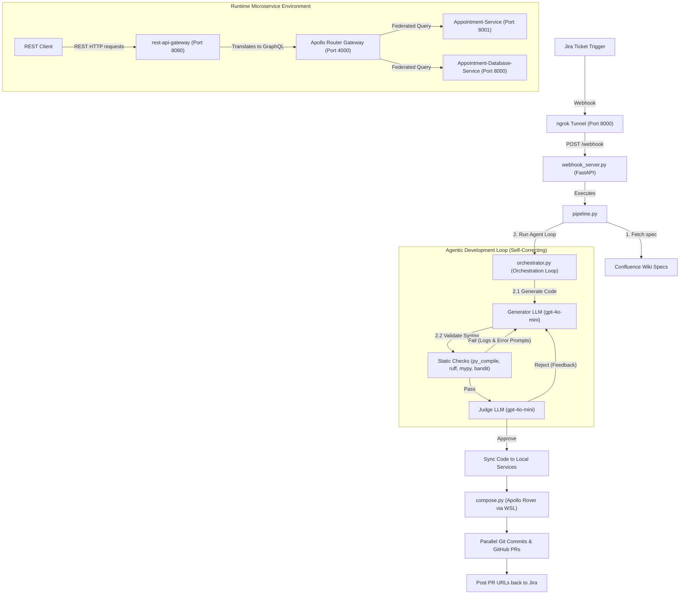

# HPE AI-Assisted GraphQL Automation Platform

This is a federated GraphQL microservice platform integrated with a self-correcting, AI-assisted development pipeline. 

The platform is designed to take Jira tickets and Confluence specifications, automatically generate schema-compliant GraphQL microservice code, perform static linting/compilation checks, evaluate it via an AI judge, compose the unified federated supergraph, and deploy parallel Pull Requests to GitHub.

---

## System Architecture

The platform consists of two main parts: the **Agentic Development Pipeline** (the automation flow) and the **Federated Microservice Architecture** (the runtime environment).

The parser error occurred because Mermaid does not support mixing `-- text -->` style arrows with the pipe `|text|` syntax on the same line. 

I will edit [README.md](file:///c:/Users/Admin/Desktop/api-graphql-automation/README.md) to fix the Mermaid diagram syntax to use standard, clean link labels.

Edited README.md

I have fixed the Mermaid syntax in the root [README.md](file:///c:/Users/Admin/Desktop/api-graphql-automation/README.md). 

Here is the corrected Mermaid diagram code that you can copy or view:



---

## Repository Breakdown

This monorepo folder links five distinct sub-repositories:

| Repository / Directory | Role | Description |
| :--- | :--- | :--- |
| [**`API-Automation-GraphQL`**](file:///c:/Users/Admin/Desktop/api-graphql-automation/API-Automation-GraphQL) | **Pipeline Engine** | Houses the webhook server (`webhook_server.py`), the CLI pipeline entry point (`pipeline.py`), the generator/judge loop (`orchestrator.py`), and local prompt templates. |
| [**`graphql-datagraph`**](file:///c:/Users/Admin/Desktop/api-graphql-automation/graphql-datagraph) | **Gateway & Schema Registry** | Configures and runs the **Apollo Router** gateway container and aggregates subgraph schemas using Apollo Rover. |
| [**`Appointment-Service`**](file:///c:/Users/Admin/Desktop/api-graphql-automation/Appointment-Service) | **Business Logic Subgraph** | A FastAPI microservice implementing high-level appointment booking rules, validation, and resolvers. |
| [**`Appointment-Database-Service`**](file:///c:/Users/Admin/Desktop/api-graphql-automation/Appointment-Database-Service) | **Database Subgraph** | A FastAPI microservice communicating directly with the SQLite database via SQLAlchemy. |
| [**`rest-api-gateway`**](file:///c:/Users/Admin/Desktop/api-graphql-automation/rest-api-gateway) | **REST Gateway Proxy** | Exposes REST endpoints to clients and translates incoming parameters into optimized GraphQL queries targeting the Apollo Router. |

---

## Operating the AI Development Pipeline

The pipeline listens for issue status changes or assignment changes in Jira, runs the code generation, and deploys the code.

### 1. Start the Webhook Server
The webhook server runs on FastAPI and listens for Jira requests:
```bash
cd API-Automation-GraphQL
python orchestrator/webhook_server.py
```

### 2. Expose the Server via ngrok
Create a public forwarding tunnel to port `8000`:
```bash
ngrok http 8000
```
Copy the generated `ngrok-free.dev` forwarding URL.

### 3. Register Jira Webhook
* Go to your **Jira Project Settings ──> System ──> Webhooks**.
* Click **Create Webhook** and paste the ngrok URL (appending `/webhook`):
  `https://your-tunnel-subdomain.ngrok-free.dev/webhook`
* Choose **Issue Updated** as the event trigger.
* Save the webhook.

### 4. Triggering the Loop
Assign any service-tagged ticket (e.g. text containing `"appointment"`) to the user **`copilotagent`** or move it to **`In Progress`**. The webhook will trigger the pipeline instantly.

---

## Running the Runtime Environment Locally

You can spin up the entire microservice runtime network using Docker Compose inside the `graphql-datagraph` folder.

### 1. Build and Run:
```bash
cd graphql-datagraph
docker-compose up --build
```

### 2. Port Mappings & Services
Once running, the services are available on the following local ports:

* **REST API Gateway**: [http://localhost:8080](http://localhost:8080) (Use this for REST client testing)
* **Apollo Router Gateway**: [http://localhost:4000](http://localhost:4000) (The unified GraphQL datagraph)
* **Appointment Service**: [http://localhost:8001/graphql](http://localhost:8001/graphql) (Subgraph endpoint)
* **Appointment Database Service**: [http://localhost:8000/graphql](http://localhost:8000/graphql) (Subgraph database endpoint)

---

## Schema Composition Fallback (WSL)
GraphQL federation relies on Apollo Rover to merge subgraphs. If your host Windows machine blocks unsigned binaries (such as `rover-0.40.0.exe` downloaded inside `node_modules`) due to **Application Control Policies**, the composition script [`compose.py`](file:///c:/Users/Admin/Desktop/api-graphql-automation/graphql-datagraph/compose.py) will automatically redirect the compilation command into your local **WSL Ubuntu** container to ensure the build completes successfully.
