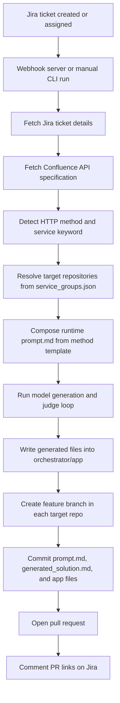

# AI-Assisted API Automation Pipeline

This project is an end-to-end automation pipeline that connects Jira, Confluence, GitHub, and GitHub Models/Copilot-style generation. It reads a Jira ticket, pulls the matching API specification from Confluence, generates implementation code using a model loop, evaluates the generated output, commits the result to one or more GitHub repositories, opens pull requests, and comments the PR links back on the Jira ticket.

The system is designed for FastAPI-style service repositories that follow a layered structure such as:

```text
routes -> services -> db_client
```

It can be tested on additional repositories, but each target repository must be added to the routing configuration and should follow a compatible project structure.

---

## What the Pipeline Does



---

## Project Structure

```text
MCP/
|-- jira-mcp-server/          Node.js MCP server for Jira tools
|-- confluence-mcp-server/    Node.js MCP server for Confluence tools
|-- github-mcp-server/        Node.js MCP server for GitHub tools
|-- orchestrator/             Core Python automation pipeline
|   |-- pipeline.py           Full end-to-end pipeline entry point
|   |-- orchestrator.py       Model generation and judging loop
|   |-- webhook_server.py     FastAPI Jira webhook listener
|   |-- service_groups.json   Maps service keywords to GitHub repositories
|   |-- api_clients/          Jira, Confluence, and GitHub REST clients
|   |-- prompts/              Optional local prompt templates/reference prompts
|   |-- app/                  Working app folder where generated code is written
|   |-- requirements.txt      Python dependencies
|-- pipeline-run-instructions.md
|-- pipeline_visual.html
|-- langgraph_visual.html
|-- README.md
```

---

## Requirements

- Python 3.10+
- Node.js 18+
- npm
- GitHub personal access token with repository permissions
- Jira API token
- Confluence API token
- Access to GitHub Models using the configured GitHub token
- Optional: GitHub CLI authenticated with `gh auth login` as a fallback token source
- Optional: ngrok or another HTTPS tunnel for live Jira webhooks

---

## Environment Configuration

Create an `.env` file inside `orchestrator/`.

```ini
# Jira
JIRA_DOMAIN=https://your-org.atlassian.net
JIRA_EMAIL=your-email@example.com
JIRA_API_TOKEN=your_jira_api_token

# Confluence
CONFLUENCE_DOMAIN=https://your-org.atlassian.net
CONFLUENCE_EMAIL=your-email@example.com
CONFLUENCE_API_TOKEN=your_confluence_api_token
CONFLUENCE_SPACE=~71202046a5693ef7834f62afe3bad6ad83fef8
CONFLUENCE_PAGE=API-Based Automation Platform

# GitHub
GITHUB_TOKEN=your_github_personal_access_token
GITHUB_OWNER=your_github_username_or_org
BASE_BRANCH=main

# Prompt templates fetched from GitHub
PROMPTS_REPO=sanskritehe/Appointment-Service
PROMPTS_BRANCH=main

# Model configuration
GENERATOR_MODEL=gpt-4o
JUDGE_MODEL=gpt-4o

# Optional webhook filter
COPILOT_ASSIGNEE=copilotagentbot@gmail.com
```

The Node.js MCP servers can also use their own `.env` files:

```text
jira-mcp-server/.env
  JIRA_DOMAIN
  JIRA_EMAIL
  JIRA_API_TOKEN

confluence-mcp-server/.env
  CONFLUENCE_DOMAIN
  CONFLUENCE_EMAIL
  CONFLUENCE_API_TOKEN

github-mcp-server/.env
  GITHUB_TOKEN
  GITHUB_OWNER
```

---

## Install Dependencies

Install Node dependencies for each MCP server:

```bash
cd jira-mcp-server
npm install

cd ../confluence-mcp-server
npm install

cd ../github-mcp-server
npm install
```

Install Python dependencies for the orchestrator:

```bash
cd ../orchestrator
pip install -r requirements.txt
```

---

## Repository Routing

The pipeline does not use a `--repo` command-line argument. Repositories are selected through `orchestrator/service_groups.json`.

Example:

```json
{
  "appointment": [
    {
      "repo": "sanskritehe/Appointment-Service",
      "role": "api",
      "operations": ["GET", "POST", "PUT", "PATCH", "DELETE"]
    },
    {
      "repo": "sanskritehe/Appointment-Database-Service",
      "role": "database",
      "operations": ["GET", "POST", "PUT", "PATCH", "DELETE"]
    }
  ]
}
```

How routing works:

1. The pipeline reads the Jira ticket summary and description.
2. It detects the HTTP method from words like `GET`, `POST`, `create`, `update`, `delete`, or `fetch`.
3. It detects a service keyword such as `appointment`, `patient`, or `billing`.
4. It selects repositories from `service_groups.json` where both the keyword and HTTP method match.
5. It opens one PR per matched repository.

## Prompt Templates

The pipeline uses method-specific prompt templates. After detecting the HTTP method, `pipeline.py` fetches:

```text
prompts/GET.md
prompts/POST.md
prompts/PUT.md
prompts/PATCH.md
prompts/DELETE.md
```

from the GitHub repository configured by:

```ini
PROMPTS_REPO=sanskritehe/Appointment-Service
PROMPTS_BRANCH=main
```

Then it creates a runtime `prompt.md` by combining:

1. The selected method template, such as `POST.md`.
2. The live Jira ticket summary, description, labels, priority, and URL.
3. The live Confluence API specification.

So `prompt.md` is not replacing the GET/POST/PUT/DELETE prompt files. It is the final generated context file created from the correct method prompt plus the current ticket and API spec.

If the configured GitHub prompt file cannot be fetched, the pipeline falls back to a basic generic template for that HTTP method.

You can override keyword detection manually:

```bash
python pipeline.py \
  --ticket KAN-1 \
  --confluence-space hpe-team2 \
  --confluence-page "Appointment Service API Spec" \
  --keyword appointment
```

---

## Testing on a New Repository

To test this automation on a repository that was not used during development:

1. Add the repository to `orchestrator/service_groups.json`.
2. Choose a keyword that will appear in the Jira ticket, or pass it manually using `--keyword`.
3. Confirm the repository base branch, usually `main`.
4. Confirm the GitHub token has permission to create branches, commit files, and open PRs.
5. Confirm the repository structure is compatible with the generated FastAPI layout.
6. Run the pipeline from the `orchestrator` folder.

Example new repo entry:

```json
{
  "inventory": [
    {
      "repo": "your-org/Inventory-Service",
      "role": "api",
      "operations": ["GET", "POST", "PUT", "PATCH", "DELETE"]
    }
  ]
}
```

Example run:

```bash
cd orchestrator
python pipeline.py \
  --ticket KAN-25 \
  --confluence-space hpe-team2 \
  --confluence-page "Inventory Service API Spec" \
  --keyword inventory \
  --base-branch main
```

Important limitation: the generation loop reads and writes code through the local `orchestrator/app` folder. If the new target repository has a very different structure, the PR may still be created, but the generated files may need manual adjustment.

---

## Run the Full Pipeline Manually

From the `orchestrator` directory:

```bash
python pipeline.py \
  --ticket KAN-1 \
  --confluence-space hpe-team2 \
  --confluence-page "Appointment Service API Spec" \
  --keyword appointment \
  --base-branch main
```

The pipeline will:

1. Fetch the Jira ticket.
2. Fetch the Confluence API specification.
3. Detect the HTTP method.
4. Resolve target repositories from `service_groups.json`.
5. Build `prompt.md`.
6. Run the generation and judge loop up to three times.
7. Save `generated_solution.md`.
8. Create a feature branch in each target repository.
9. Commit generated files.
10. Open pull requests.
11. Add the PR links as a Jira comment.

---

## Run Only the Generation Loop

Use this mode when `prompt.md` already exists in the `orchestrator` directory and you only want to test generation locally.

```bash
cd orchestrator
python orchestrator.py
```

Outputs:

```text
orchestrator/generated_solution.md
orchestrator/app/
```

---

## Run the Jira Webhook Server

The webhook server listens for Jira issue update events and triggers the full pipeline when a ticket is assigned to the configured automation user.

### 1. Configure webhook environment values

In `orchestrator/.env`, set the default Confluence page and base branch that webhook-triggered runs should use:

```ini
CONFLUENCE_SPACE=hpe-team2
CONFLUENCE_PAGE=Appointment Service API Spec
BASE_BRANCH=main
```

Optionally restrict automation to one Jira assignee:

```ini
COPILOT_ASSIGNEE=copilotagentbot@gmail.com
```

If `COPILOT_ASSIGNEE` is set, the webhook ignores Jira updates unless the issue assignee email or display name matches this value. If it is empty, the webhook accepts assigned issues as long as it can resolve a service keyword.

### 2. Start the local webhook server

```bash
cd orchestrator
python webhook_server.py
```

The server runs on:

```text
http://localhost:8000
```

Health check:

```text
http://localhost:8000/health
```

Open the health URL in a browser or call it from a terminal. Expected response:

```json
{"status":"ok"}
```

### 3. Expose the local server with ngrok

Jira needs a public HTTPS URL. Keep the webhook server running, then start ngrok in another terminal:

```bash
ngrok http 8000
```

Copy the HTTPS forwarding URL from ngrok and append `/webhook`.

```text
https://your-ngrok-url.ngrok-free.app/webhook
```

### 4. Create the Jira webhook

In Jira or Atlassian admin:

1. Go to system settings or Jira settings.
2. Open Webhooks.
3. Create a new webhook.
4. Set the webhook URL to the ngrok URL ending in `/webhook`.
5. Select the `Issue updated` event.
6. Save the webhook.

Recommended event:

```text
Issue updated
```

### 5. Trigger the automation

Update a Jira issue so that:

1. The issue has an assignee.
2. If `COPILOT_ASSIGNEE` is configured, the assignee matches it.
3. The summary or description contains a service keyword from `orchestrator/service_groups.json`, such as `appointment`, `patient`, or `billing`.

When the webhook receives a valid event, it runs:

```bash
python pipeline.py \
  --ticket <ISSUE-KEY> \
  --confluence-space <CONFLUENCE_SPACE> \
  --confluence-page <CONFLUENCE_PAGE> \
  --keyword <detected-keyword> \
  --base-branch <BASE_BRANCH>
```

The server response includes the detected ticket, keyword, and target repositories. The terminal running `webhook_server.py` shows the full pipeline progress.

### 6. Common webhook issues

- `ignored: no assignee set`: assign the Jira issue before triggering the webhook.
- `ignored: assignee is not the copilot agent`: update `COPILOT_ASSIGNEE` or assign the issue to the configured automation user.
- `ignored: no matching service keyword found`: add a keyword to the Jira ticket text or add the service to `service_groups.json`.
- Ngrok URL changed: update the Jira webhook URL with the new ngrok forwarding URL.

---

## Claude Desktop MCP Setup

The MCP servers can also be registered with Claude Desktop for manual tool-based testing.

Claude config path:

```text
Windows: %APPDATA%\Claude\claude_desktop_config.json
macOS: ~/Library/Application Support/Claude/claude_desktop_config.json
```

Example:

```json
{
  "mcpServers": {
    "jira": {
      "command": "node",
      "args": ["C:/Users/Admin/Desktop/MCP SEND/MCP_Final/MCP/jira-mcp-server/server.js"]
    },
    "confluence": {
      "command": "node",
      "args": ["C:/Users/Admin/Desktop/MCP SEND/MCP_Final/MCP/confluence-mcp-server/server.js"]
    },
    "github": {
      "command": "node",
      "args": ["C:/Users/Admin/Desktop/MCP SEND/MCP_Final/MCP/github-mcp-server/server.js"]
    }
  }
}
```

Restart Claude Desktop after editing this file.

---

## Troubleshooting

### No repository matched

Cause: the ticket text did not contain a keyword from `service_groups.json`, or the detected HTTP method is not allowed for that repo.

Fix:

```bash
python pipeline.py ... --keyword appointment
```

Also confirm that the repo entry includes the detected operation:

```json
"operations": ["GET", "POST", "PUT", "PATCH", "DELETE"]
```

### GitHub authentication errors

Cause: missing, expired, or under-scoped GitHub token.

Fix:

```bash
gh auth login
```

Or update:

```ini
GITHUB_TOKEN=your_valid_token
```

The token must be able to create branches, write files, and open pull requests.

### Confluence page not found

Cause: incorrect space key, page title, or token permissions.

Fix: verify the exact Confluence space key and page title, then rerun with:

```bash
python pipeline.py --confluence-space hpe-team2 --confluence-page "Exact Page Title" ...
```

### Generated files do not fit the target repo

Cause: the target repo has a different architecture than the FastAPI layered structure expected by the prompt.

Fix: update the prompt template, update `orchestrator/app` to mirror the target repo structure, or manually adjust the generated PR.

---

## Current Design Notes

- `pipeline.py` is the main end-to-end runner.
- `orchestrator.py` performs generation and judging.
- `service_groups.json` controls multi-repo fan-out.
- `webhook_server.py` triggers the same pipeline from Jira webhooks.
- The generated branch name includes the ticket key, method, and timestamp.
- The model judge checks API implementation quality only. GitHub branch, commit, and PR operations are handled separately by the pipeline.
