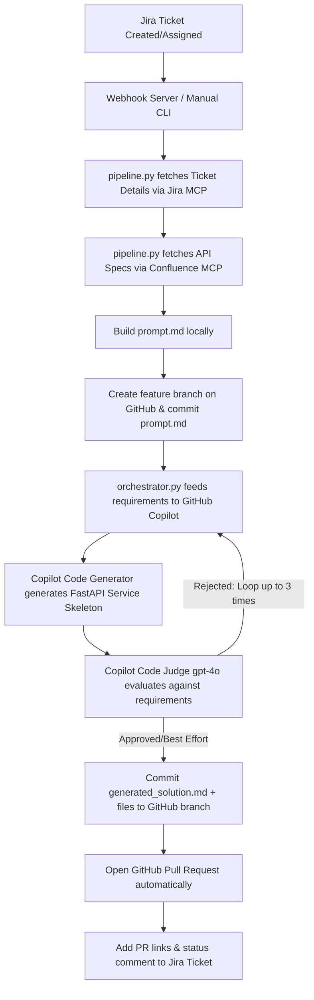

# AI-Assisted Dev Pipeline (MCP + Copilot Engine)

Welcome to the **AI-Assisted Dev Pipeline**—a premium, fully automated developer agent and pipeline integration. This project connects **Jira**, **Confluence**, **GitHub**, and **GitHub Copilot** (via the official GitHub Models API) using the **Model Context Protocol (MCP)** to fetch ticket details, read API specifications, generate robust, structured code, perform self-evaluation, and open Pull Requests automatically.

---

## Architectural Workflow

The following diagram outlines the automated cycle when a Jira ticket is processed by the pipeline:



---

## Project Structure

```text
MCP/
├── jira-mcp-server/          # Node.js MCP server exposing Jira tools to LLM/Claude
├── confluence-mcp-server/    # Node.js MCP server exposing Confluence tools to LLM/Claude
├── github-mcp-server/        # Node.js MCP server exposing GitHub repo, commit, and PR tools
└── orchestrator/             # Core Python Pipeline & Webhook Runner
    ├── pipeline.py           # End-to-end pipeline entry point (manual runner)
    ├── orchestrator.py       # GitHub Copilot (gpt-4o) generation + evaluation loop
    ├── webhook_server.py     # FastAPI server that listens for live Jira ticket webhooks
    ├── service_groups.json   # Maps Jira keywords & operations to target GitHub repositories
    ├── prompt.md             # Generated prompt context (created at runtime)
    └── app/                  # Skeleton folder where Copilot writes code files
```

---

## Environment Configuration

To configure the pipeline, you need to populate `.env` files. The project contains multiple folders, but the core settings reside in **`orchestrator/.env`** and individual **MCP server directories**.

### 1. Orchestrator Configuration (`orchestrator/.env`)
Create or edit `orchestrator/.env` and configure the following parameters:

```ini
# ── Webhook Server Defaults ───────────────────────────────────────────
CONFLUENCE_SPACE=~71202046a5693ef7834f62afe3bad6ad83fef8
CONFLUENCE_PAGE=API-Based Automation Platform
GITHUB_REPO=sanskritehe/Appointment-Service
PROMPTS_REPO=sanskritehe/Appointment-Service
PROMPTS_BRANCH=main
BASE_BRANCH=main

# ── Multi-Service Repo Routing ────────────────────────────────────────
# Keyword mapping for fanning out changes in a multi-service structure
# Format: keyword1:owner/repo1,keyword2:owner/repo2
REPO_MAP=appointment-database-service:sanskritehe/Appointment-Database-Service,appointment service:sanskritehe/Appointment-Service

# ── Jira Integration ──────────────────────────────────────────────────
JIRA_DOMAIN=https://your-org.atlassian.net
JIRA_EMAIL=your-email@example.com
JIRA_API_TOKEN=your_jira_api_token

# ── Confluence Integration ────────────────────────────────────────────
CONFLUENCE_DOMAIN=https://your-org.atlassian.net
CONFLUENCE_EMAIL=your-email@example.com
CONFLUENCE_API_TOKEN=your_confluence_api_token

# ── GitHub Integration ────────────────────────────────────────────────
GITHUB_TOKEN=your_github_personal_access_token
GITHUB_OWNER=your_github_username_or_org

# ── Copilot & Models Configuration ────────────────────────────────────
# The pipeline automatically looks up GITHUB_TOKEN or COPILOT_GITHUB_TOKEN.
# If both are empty or invalid, it gracefully falls back to your local authenticated GitHub CLI token!
COPILOT_GITHUB_TOKEN=your_github_pat_with_copilot_permissions

# Model parameters
GENERATOR_MODEL=gpt-4o
JUDGE_MODEL=gpt-4o
```

---

## Setup & Installation

### Step 1: Install Node.js Dependencies (MCP Servers)
For each MCP server, navigate to its folder and install dependencies:

```bash
# 1. Jira MCP Server
cd jira-mcp-server
npm install

# 2. Confluence MCP Server
cd ../confluence-mcp-server
npm install

# 3. GitHub MCP Server
cd ../github-mcp-server
npm install
```

### Step 2: Configure MCP Server Environment Variables
Ensure each server directory contains a valid `.env` file matching their requirements:
*   **`jira-mcp-server/.env`**: `JIRA_DOMAIN`, `JIRA_EMAIL`, `JIRA_API_TOKEN`
*   **`github-mcp-server/.env`**: `GITHUB_TOKEN`, `GITHUB_OWNER`

### Step 3: Install Python Dependencies (Orchestrator)
Navigate to the `orchestrator` directory, ensure Python 3.10+ is active, and install dependencies:

```bash
cd ../orchestrator
pip install -r requirements.txt
```

---

## Running & Integrating MCP Servers with Claude Desktop

To interact with these MCP servers manually via the Claude Desktop app, register them in your global Claude configuration file:

*   **File Path**: `%APPDATA%\Claude\claude_desktop_config.json` (Windows) or `~/Library/Application Support/Claude/claude_desktop_config.json` (macOS)

Add the following JSON configurations (replace absolute paths and details with your local directories):

```json
{
  "mcpServers": {
    "jira": {
      "command": "node",
      "args": ["C:/Users/Admin/Desktop/MCP/MCP_Final/MCP/jira-mcp-server/server.js"]
    },
    "confluence": {
      "command": "node",
      "args": ["C:/Users/Admin/Desktop/MCP/MCP_Final/MCP/confluence-mcp-server/server.js"]
    },
    "github": {
      "command": "node",
      "args": ["C:/Users/Admin/Desktop/MCP/MCP_Final/MCP/github-mcp-server/server.js"]
    }
  }
}
```

*Note: Restart Claude Desktop after saving the configuration file to apply changes.*

---

## Running the Orchestrator Pipeline

### Option A: Manual Full Automated Pipeline Execution (CLI)
You can run the end-to-end pipeline from your terminal by specifying the Jira ticket key and Confluence requirements:

```bash
cd orchestrator
python pipeline.py \
  --ticket KAN-1 \
  --confluence-space hpe-team2 \
  --confluence-page "Appointment Service API Spec"
```

**What it does automatically**:
1.  **Fetches ticket** `KAN-1` from Jira.
2.  **Fetches specifications** from the specified Confluence page.
3.  **Parses operations** and detects HTTP methods (e.g., `POST`, `GET`, `DELETE`).
4.  **Generates prompt context** (`prompt.md`) containing requirements + specs + existing code.
5.  **Performs code generation and review** inside a 3-iteration loop using GitHub Copilot (`gpt-4o`).
6.  **Creates feature branch** on GitHub, commits code, and opens a Pull Request.
7.  **Comments on the Jira ticket** with standard PR links.

---

### Option B: Standalone Code Generation & Judging (Orchestrator Only)
If you already have a local `prompt.md` containing requirements and want to run *only* the Copilot code generation & evaluation loop locally:

```bash
cd orchestrator
python orchestrator.py
```
*Output: Code files written directly to the `./app` directory, and `generated_solution.md` created in the current directory.*

---

## Deploying the Webhook Server for Live Automation

The pipeline includes a **FastAPI Webhook Server (`webhook_server.py`)** that can listen for live Jira webhook events (e.g., when a ticket is assigned to the bot `copilotagentbot@gmail.com`). When triggered, it kicks off the pipeline in the background.

### 1. Launching the Webhook Server Locally

To run the webhook server locally on port `8000`:

> [!IMPORTANT]
> To prevent Uvicorn's reload mechanism from watching the generated code directory and crashing the background pipeline process, the webhook server has programmatic excludes pre-configured. **Always start the webhook server using the Python runner command below:**


```bash
cd orchestrator
# Recommended: Runs the server and automatically excludes generated folders from auto-reload
python webhook_server.py
or 
uvicorn webhook_server:app --port 8000
```

### 2. Exposing to the Internet (e.g., using ngrok)
Jira requires an HTTPS endpoint to send webhook notifications. Expose your local port `8000` via ngrok:

```bash
ngrok http 8000
```
Copy the generated public forwarding URL (e.g., `https://xxxx.ngrok-free.app`).

### 3. Configuring Jira Webhooks
1.  Go to your **Atlassian Admin Console** -> **System Settings** -> **Webhooks**.
2.  Click **Create a Webhook**.
3.  Set the **URL** to: `https://xxxx.ngrok-free.app/webhook` (append `/webhook`).
4.  Under **Events**, check **Issue -> Updated**.
5.  Save the Webhook.

Now, whenever a story/ticket in Jira has its assignee updated to the Copilot agent, the Webhook Server will instantly trigger the full Copilot Generation & Judging pipeline!

---

## Troubleshooting & Technical Notes

### Authentication Error (401 / 403 / 404)
*   **Cause**: The token provided under `COPILOT_GITHUB_TOKEN` or `GITHUB_TOKEN` is expired, invalid, or lacks the necessary scopes.
*   **Resolution**: 
    *   Log in via the official GitHub CLI on your terminal using: `gh auth login`.
    *   The orchestrator will automatically query and use your active GitHub CLI session token, securing 100% stable connection out of the box!

### Minimal Change Integrity
*   The `orchestrator.py` uses system prompt guardrails instructing Copilot to **only** write or modify files directly related to the requirements. It strictly minimizes modifications to unrelated files in the repo structure.

---


